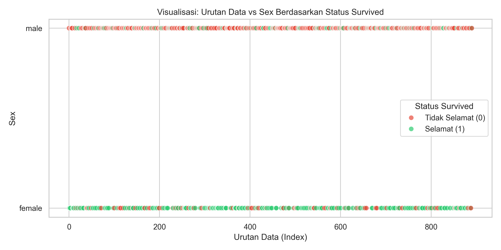
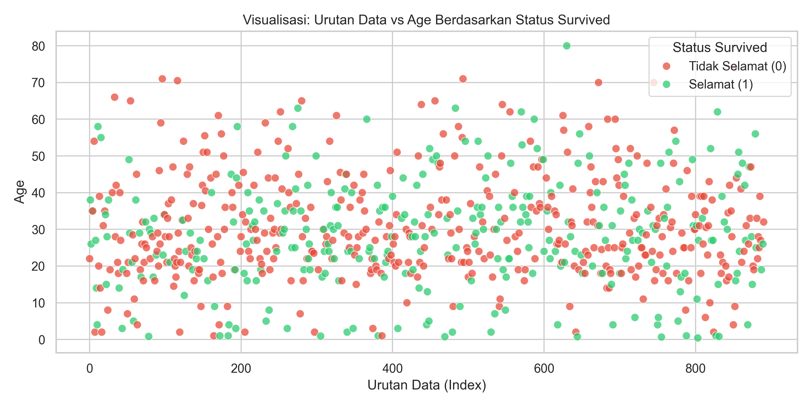

# 🚢 Praktikum Data Preprocessing & Visualisasi - Titanic Dataset

Repositori ini berisi pengerjaan tugas dan latihan **Pertemuan 2 Mata Kuliah Web Data Mining**, yang berfokus pada tahapan *data preprocessing*, manipulasi data dengan **Pandas**, serta visualisasi data menggunakan **Matplotlib** dan **Seaborn** pada dataset penumpang kapal Titanic.

---

## 📁 Struktur Direktori

```text
.
├── data/
│   └── titanic.csv                  # Dataset mentah Titanic
├── jawaban/
│   ├── 01_load_dataset.py           # Membaca & menampilkan dataset
│   ├── 02_jumlah_baris_kolom.py     # Cek ukuran dimensi dataset
│   ├── 03_fitur_dataset.py          # Ekstraksi subset kolom fitur
│   ├── 04_kelas_survived.py         # Ekstraksi kolom target (Survived)
│   ├── 05_tambah_fitur_relatives.py # Feature engineering: fitur Relatives
│   ├── 06_hitung_pclass.py          # Distribusi penumpang per Pclass
│   ├── 07_hitung_sex.py             # Distribusi penumpang per jenis kelamin
│   ├── 08_survived_per_pclass.py    # Tabel silang (crosstab) keselamatan per Pclass
│   ├── 09_visualisasi_sex_survived.py # Scatter plot urutan data vs Sex
│   └── 10_visualisasi_age_survived.py # Scatter plot urutan data vs Age (tanpa NaN)
├── output/
│   ├── visualisasi_no9_sex_survived.png   # Hasil grafik visualisasi soal 9
│   └── visualisasi_no10_age_survived.png  # Hasil grafik visualisasi soal 10
├── materi/
│   └── 2. Data Preprocessing (Data Manipulation _ Visualisation) (prak).pdf
├── latihan_pertemuan_2.py          # Script gabungan (seluruh soal 1-10)
├── Latihan_Pertemuan_2.ipynb        # Jupyter Notebook interaktif
└── README.md
```

---

## 📋 Ringkasan Pengerjaan Soal

| No | Tugas / Soal | Penjelasan Singkat |
|:--:|:---|:---|
| **1** | **Load Dataset** | Memuat file `titanic.csv` menggunakan `pd.read_csv()` dan menampilkan sampel 5 data teratas (`.head()`). |
| **2** | **Dimensi Dataset** | Mengecek ukuran matriks data dengan `.shape` (Hasil: 891 baris dan 12 kolom). |
| **3** | **Ekstraksi Fitur** | Mengambil 5 fitur independen: `Name`, `Sex`, `Age`, `Pclass`, dan `Fare`. |
| **4** | **Ekstraksi Kelas** | Mengisolasi kolom target `Survived` (`1` = Selamat, `0` = Tidak Selamat). |
| **5** | **Feature Engineering** | Menambahkan fitur baru `Relatives` dari rumus `SibSp + Parch` (total keluarga di kapal). |
| **6** | **Frekuensi Pclass** | Menghitung jumlah penumpang per kelas (Pclass 1: 216, Pclass 2: 184, Pclass 3: 491). |
| **7** | **Frekuensi Sex** | Menghitung proporsi gender (Laki-laki: 577 orang / ~64.8%, Perempuan: 314 orang / ~35.2%). |
| **8** | **Crosstab Keselamatan** | Analisis silang tingkat selamat per kelas kabin menggunakan `pd.crosstab()`. |
| **9** | **Visualisasi Gender** | Scatter plot persebaran status selamat berdasarkan jenis kelamin. |
| **10** | **Visualisasi Usia** | Scatter plot sebaran umur vs keselamatan setelah membuang nilai *missing value* (`dropna`). |

---

## 📊 Hasil Visualisasi

### 1. Sebaran Keselamatan Berdasarkan Gender (Soal 9)

> **Insight:** Penumpang perempuan didominasi oleh titik hijau (selamat), mengonfirmasi penerapan aturan evakuasi *"Women and children first"*.

### 2. Sebaran Keselamatan Berdasarkan Umur (Soal 10)

> **Insight:** Kelompok anak-anak (<10 tahun) memiliki tingkat keselamatan yang tinggi dibandingkan kelompok usia dewasa dan lanjut usia.

---

## 🚀 Cara Menjalankan

1. **Clone repositori ini:**
   ```bash
   git clone https://github.com/GusthiPangestu1906/WDM.1-Data_Preprocessing.git
   cd WDM.1-Data_Preprocessing
   ```

2. **Pastikan library yang dibutuhkan terinstall:**
   ```bash
   pip install pandas matplotlib seaborn
   ```

3. **Menjalankan script per nomor soal:**
   ```bash
   # Contoh menjalankan soal nomor 1
   python jawaban/01_load_dataset.py

   # Contoh menjalankan visualisasi soal nomor 9
   python jawaban/09_visualisasi_sex_survived.py
   ```

4. **Menjalankan seluruh soal sekaligus:**
   ```bash
   python latihan_pertemuan_2.py
   ```
   Atau buka file `Latihan_Pertemuan_2.ipynb` menggunakan Jupyter Lab / VS Code.

---

## 💡 Kesimpulan Utama
- **Faktor Gender:** Penumpang wanita memiliki rasio bertahan hidup yang jauh lebih tinggi dibandingkan laki-laki.
- **Faktor Sosio-Ekonomi:** Penumpang Kelas 1 (kabin atas) memiliki persentase kelangsungan hidup tertinggi (>60%), sedangkan lebih dari 75% penumpang Kelas 3 tidak selamat.
- **Pentingnya Preprocessing:** Teknik pemilihan kolom, pembuatan fitur keluarga (*Relatives*), serta pembersihan data kosong (*missing value*) sangat krusial untuk menghasilkan visualisasi dan analisis data yang akurat.
